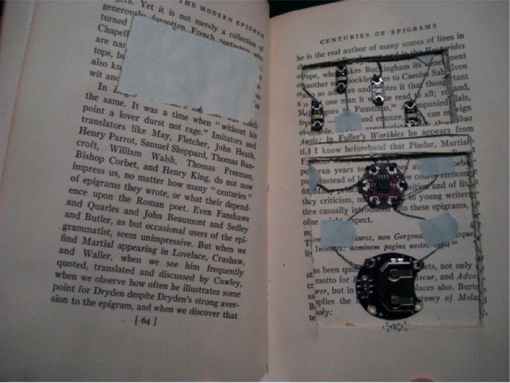
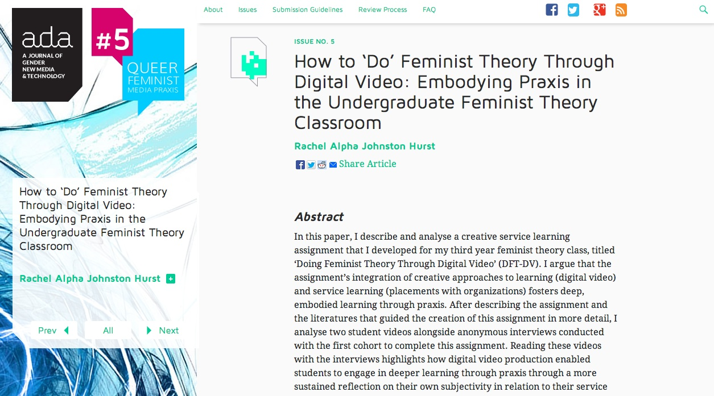
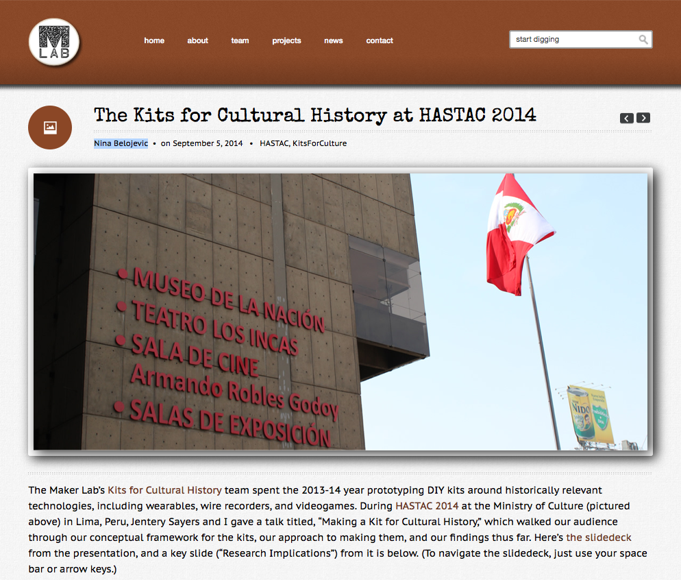
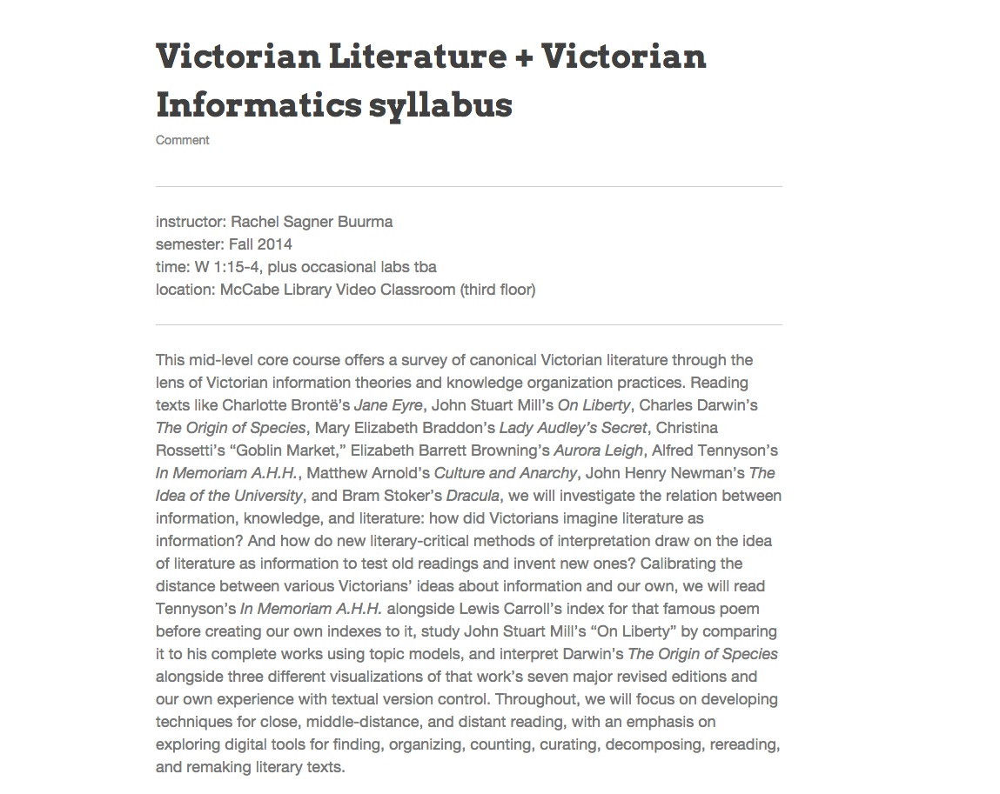
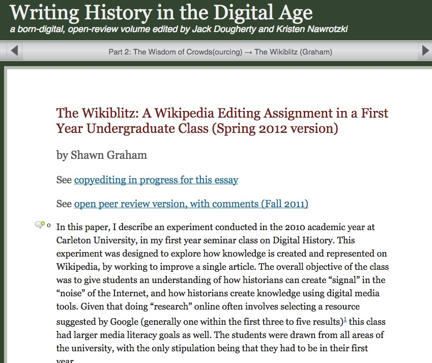
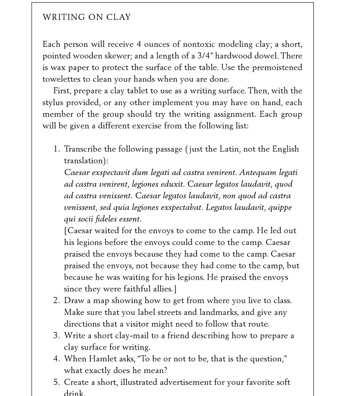

# Praxis

## Authors

* Bethany Nowviskie
* J. K. Purdom Lindblad
* Jeremy Boggs

## List of Curated Pedagogical Resources

* “Bibliocircuitry and the Design of the Alien Everday,” Charity
  Hancock, et. al.,
  http://scholarworks.iu.edu/journals/index.php/textual/article/view/5051
  (sample student projects)
* “Doing Feminist Theory with Digital Video,” Rachel Alpha Johnston
  Hurst, http://adanewmedia.org/2014/07/issue5-hurst/ (article)
* “Extraordinary Materials,” Daniela K. Rosner,
  http://dada.cca.edu/~drosner/materials/syllabus.html (syllabus)
* "How Did They Make That?" Miriam Posner,
  http://miriamposner.com/blog/how-did-they-make-that/ (tech
  showcase/how-to)
* “The Kits for Cultural History at HASTAC 2014,” Nina Belojevic,
  http://maker.uvic.ca/lima/ (sample student projects)
* “Lying about the Past,” T. Mills Kelly,
  http://chnm.gmu.edu/history/faculty/kelly/blogs/h389/f08syl.pdf
  (syllabus)
* **Praxis Network**, http://praxis-network.org (institutional models)
* “Victorian Literature + Victorian Informatics,” Rachel Sagner Buurma,
  http://rachelsagnerbuurma.org/uncategorized/vic_info-draft-syllabus/
  (syllabus)
* “The Wikiblitz: A Wikipedia Editing Assignment in a First Year
  Undergraduate Class (Spring 2012 version),” Shawn Graham,
      http://writinghistory.trincoll.edu/crowdsourcing/graham-2012-spring/
  (class exercise)
* “Writing on Clay,” **A Better Pencil: Readers, Writers, and the
  Digital Revolution,** Dennis E. Baron,
  http://books.google.com/books?id=VWzgtZMJCwgC&lpg=PP1&dq=better%20pencil&pg=PA71#v=onepage&q=modeling%20clay&f=false

## Curatorial Statement

Praxis, as we understand it and practice it in our day-to-day academic
work, is generally less concerned with end products, and more concerned
by the *process* through which things are made, and the manner in which
they are made. More specifically, we see praxis as the process of making
to realize, expose, critique, and generate theoretical/ideological
concepts. We find four particularly useful considerations of praxis.

* **Praxis as an embodiment of an idea.** Set out to make or do
  something that embodies an existing theory or idea.
* **Praxis as teacher/illuminator of an idea.** In the process of making
  or doing something, reveal and learn theoretical/intellectual.
  concepts.
* **Praxis as critic of an idea.** In the process of making or doing
  something, challenge or question existing concepts.
* **Praxis as genesis of an idea.** In the process of making or doing,
  devise a new theory or idea.

### Our Pedagogy

Almost everything we do—our internal projects, our collaborations with
faculty, our graduate fellowships and training opportunities—features
praxis as a central concern and goal. We are more interested in making
people, not tools, and in that endeavor we almost always emphasize
learning *how* to do something and *why* to do something, and not merely
make things for people. Praxis is a central tenent of the ethos of the
Scholars' Lab and for nearly all our interactions with collaborators.

We have two graduate fellowship programs where we emphasize the
importance of praxis in humanities work: Digital Humanities Fellowship
and Praxis Program Fellowship. Our students are typically humanities
graduate students, and with a few exceptions are PhD students who have
yet to advance.  Our Digital Humanities Fellowship offers students time
and community to implement a digital component of their research.
Scaffolding tech skills with mentorship models an iterative process of
collaborative work. The Fellowship carves out time for reflection,
experimentation, as well as support for implementing the results into a
digital project.

Similarly, our Praxis Program reimagines graduate training in the
humanities for the demands of the digital age. The Praxis Programs
unites six graduate students from across the humanities and social
sciences to design and build a digital tool. Like the Digital
Humanities Fellowship, the Praxis Program seeks to provide time--time
for exploration, for reflection, for collaboration--to reimagine what
scholarly work looks like. Praxis Fellows work alongside the Scholars'
Lab staff throughout the cycle of creating, building, and launching a
digital project.

Again, with both of these programs, we're more interested in developing
people instead of products, and we'll often consider a collaboration a
success if we've influenced processes through which students conduct and
evaluate their scholarly work. A pedagogy of praxis attends equally
to processes and manner and ensures that the process of making is
instructive.

### Rationale and Criteria

Our approach in selecting resources involved three broad requirements:
First, we decided to select publicly available, open access resources.
Praxis seems most successful when as many impedements to development and
process are removed.

Second, we wanted to include a range of resources: Syllabi that discuss,
organize, and present praxis to students; Lessons that detail process
behind a particular praxis assigment and possible outcomes; Project
showcases that demonstrate completed assigments and reflections on
those assigments, or elaborate on the tools and process that go into
making a particular project; Articles that reflect and elaborate on the
importance of praxis for teaching and learning. It was important to us
to include resources ranging in application and type, to show that
considerations of praxis can be addressed in a variety of formats.

Third, we felt it important to select resources that demonstrate the
interconnected, symbiotic relationships among praxis, theory, and
product. All of these resources highlight this importance: that none can
or should exist in isolation, and exploring one should necessarily
mean exploring the others. In particular, we feature resources that
succeed in demonstrating that the best way to learn the value of praxis
is by *acutally engaging in praxis*. These resources do not just talk
about the importance of praxis in the abstract; They all provide
examples of praxis in action.

## Curated Pedagogical Resources

### “Bibliocircuitry and the Design of the Alien Everday”

* Screenshot: 
* Source URL: http://scholarworks.iu.edu/journals/index.php/textual/article/view/5051
* Name of Creator: Charity Hancock, Clifford Hichar, Carlea Holl-Jensen, Kari Kraus, Cameron Mozafari, Kathryn Skutlin
* Attribution Information:

An article detailing student exploration of the concept of *reflective
design* by investigating the book as interface. The projects perfectly
highlight the way that an emphasis on, and exposure of, process leads to
unforseen insights. They also emphasize that *digital* often involves
considerations regarding hardware and physical/tactile design. Teachers
might a particular object or set of objects and ask students to figure
out ways to alter or enhance their interface.

### “Doing Feminist Theory through Digital Video”
* Screenshot:
* Source URL:
  [http://adanewmedia.org/2014/07/issue5-hurst/](http://adanewmedia.org/2014/07/issue5-hurst/)
* Name of Creator:
  [http://www.rachelhurst.ca/Dr._Rachel_Alpha_Johnston_Hurst/Welcome%21.html](Rachel
  Alpha Johnston Hurst)
* Attribution Information: Rachel Alpha Johnston Hurst is an associate
  professor of [http://sites.stfx.ca/womens_and_gender_studies/](Women's
  and Gender Studies) at [http://www.stfx.ca/](St. Francis Xavier
  University) in Antigonish, Nova Scotia.

*Doing Feminist Theory through Digital Video* is a reflective essay
detailing Hurst's undergraduate assignment and the literature informing
the development of the assignment. Noticing her undergraduates were
struggling to connect the rich theoretical discussions within the
classroom to 'real life', Hurst details how specific theoretical
considerations (e.g. Feminism) shape and can by shaped by praxis
applications.

Hurst applies Paulo Freire's definition of praxis, 'reflection and
action upon the world in order to change it', to her assignment with the
goal of fostering sustained deep reflection, both of the theoretical
foundations for her course as well as on the student's emerging
scholarly voice.

A semester-long, service-learing project is difficult to integrate into
an existing course. Rather, Hurst's article outlines strategies for
nurturing deep learning through relfection and praxis. Reflecting on her
process as well as implementation, Hurst points to methods for
demystifying knowledge creation through itterative, collaborative
work.

### “Extraordinary Materials”
* Screenshot: 
* Source URL:
  [http://dada.cca.edu/~drosner/materials/syllabus.html](http://dada.cca.edu/~drosner/materials/syllabus.html)
* Name of Creator: [http://danielarosner.com](Daniela K. Rosner)
* Attribution Information: Daniela Rosner is an assistant professor of
  [http://www.hcde.washington.edu/] (Human Centered Design and
  Engineering) and co-direct the
  [http://depts.washington.edu/tatlab/blog/](TAT Lab) at the
  [http://www.washington.edu/](University of Washington)

(Extra)ordinary *Materials* is a course focusing on "thinking and
experimenting with materials that have extraordinary properties around
ordinary practices as an entry point for identifying new affordances in
form-giving work." With a detailed syllabus and a blend of intriguing
readings, hands-on experiements, and student participation,
(Extra)ordinary *Materials* exemplifies praxis through deep
investigations of specific materials along side explorations of the
ideas of  "mutability, reproduction, age and belonging."

Readings are paired with hands-on, both individual and class,
investigations and reflective reports. Rosner includes thoughtful
learning outcomes along with explicit pairings of hands-on work and
theoretical readings to best explore range of materials and
properties.

### “How Did They Make That?”

* Screenshot: 
* Source URL:
  [http://miriamposner.com/blog/how-did-they-make-that/](http://miriamposner.com/blog/how-did-they-make-that/)
* Name of Creator: Miriam Posner
* Attribution Information: Posner coordiates and teaches in the [Digital
  Humanites program at UCLA](http://www.cdh.ucla.edu/). She has a Ph.D.
  from Yale University, in Film Studies and American Studies.

Miriam Posner offers a modest gallery of various digital projects, and
breaks each down into the tools and techniques used in their production.
The goal is to show how each is made, so others might also make similar
projects and build from them. The site would be a perfect starting
point for students before their own digital projects. Have students
visit the site, then visit each example project, to see how the list of
parts and techniques used on a project correspond to specific results.
Get a feel for what different types of projects offer.

### “The Kits for Cultural History at HASTAC 2014”

* Screenshot: 
* Source URL
* Name of Creator
* Attribution Information:

An introduction and rationale for the *Kits for Cultural History*
projects at the University of Victoria Makerlab.

### “Lying about the Past”

* Screenshot: 
* Source URL:
  [http://chnm.gmu.edu/history/faculty/kelly/blogs/h389/f08syl.pdf](http://chnm.gmu.edu/history/faculty/kelly/blogs/h389/f08syl.pdf)
* Name of Creator: T. Mills Kelly
* Attribution Information:

T. Mills Kelly's 2008 syllabus for a course teaching students how to debunk
historial hoaxes, and how to create their own.

### Praxis Network

The Praxis Network models eight allied, but differently-inflected
humanities and social sciences methods training. Each program is engaged
in rethinking pedagogy and collaborative partnerships

Realizing each institution is made up of a particular ecosystem unique
to a specific institution, the Praxis Network showcases examples of
approaches to collaborative, humanities-based methods training for
digital work. Insitutitions and programs seeking to enact similar
efforts can compare missions, structures, research foci, support,
strategic directions, and nuts and bolts of the Praxis Network
programs.

### “Victorian Literature + Victorian Informatics”
* Screenshot: 
* Source
  URL:[http://rachelsagnerbuurma.org/uncategorized/vic_info-draft-syllabus/]
  (http://rachelsagnerbuurma.org/uncategorized/vic_info-draft-syllabus/)
* Name of Creator: [http://rachelsagnerbuurma.org/](Rachel Sagner
  Buurma)
* Attribution Information: Rachel Sagner Buurma is an associate
  professor in the
  [http://www.swarthmore.edu/english-literature](Department of English
  Literature) at [http://www.swarthmore.edu](Swarthmore College).

Victorian Literature and Victorian Inforamtics is a richly detailed
syllabus exploring "canonical Victorian literature through the lens of
Victorian Informatian theory and knowledge organization practices."
Buurma blends close, middle-distance, and distant reading techniques
with an emphasis on digital tools as a way of reading and
re-reading/re-making literary texts.

With a variety of workshops, demonstrations, discussions, and readings,
Buurma's syllabus exemplifies ways to incorporate new critical methods
and interpretations into familiar material. Individual topics along with
related readings, tools, and workshops can readily be incorporated into
an existing course, or a new course could be developed along a similar
model.

### “The Wikiblitz: A Wikipedia Editing Assignment in a First Year
Undergraduate Class (Spring 2012 version)”
* Screenshot: 
* Source URL:
  [http://writinghistory.trincoll.edu/crowdsourcing/graham-2012-spring/](
  http://writinghistory.trincoll.edu/crowdsourcing/graham-2012-spring/)
* Name of Creator: [http://www.graeworks.net/](Shawn Graham)
* Attribution Information: Shawn Graham is an assistant professor in the
  [http://www.carleton.ca/history/](Department of History) at
  [http://carleton.ca/](Carleton University).

Graham describes an in-class assignment designed to
"explore how knowledge is created and represented on Wikipedia, by
working to improve a single article." Intended to provide deep
understandings of how knowledge is created by and used via digital
platforms, Graham's assignment was situated in a course exploring
historical materials on the Internet. Graham's article reflects on the
overall course and the specifics of the Wikipedia assignment with a
particular focus on preparing students to engage with and critique the
tools for wriitng history in our digital age.

Graham's article is particularly useful as he outlines the context in
which the assignment was situated into the broader course, the expected
and unexpected outcomes, his rubric, and student feedback. Graham
details the work invested in preparing students for the 2-course
sessions assignment, which smooth the process of adapting the assignment
for other courses.

### “Writing on Clay”
* Screenshot: 
* Source URL:
  [http://books.google.com/books?id=VWzgtZMJCwgC&lpg=PP1&dq=better%20pencil&pg=PA74#v=onepage&q=modeling%20clay&f=false](Lesson
  Plan, Writing on Clay)
* Name of Creator:
  [http://www.english.illinois.edu/-people-/faculty/debaron/](Dennis E.
  Baron)
* Attribution Information: Dennis Baron is a professor of
  [http://www.english.illinois.edu/](English) at the
  [http://illinois.edu/](University of Illinois).

Baron's deceptively simple in-class exercise on writing with clay
encourages students to think about how technology affects their writing,
reading, and understanding. Foregrounding the materiality of expression,
Baron's exercise makes obvious the many layers of the physical act of
communication. To write on clay, the student must prepare the surface,
estimate the expected space needed for the writing, adjust methods for
correcting mistakes or revising the text, as well as calls into question
ways of sharing and preserving the finished writing.

Baron's exercise requires little pre-planning, but does demand time for
reflection.

## 5. Related Materials (Bulleted List)

* **Pedagogy of the Oppressed**,
  http://fablearn.stanford.edu/fellows/blog/pedagogy-oppressed-practice-praxis
* **New Culture of Learning**, http://www.newcultureoflearning.com/
* “Connected Learning: An Agenda for Research and Design,”
  http://clrn.dmlhub.net/publications/connected-learning-an-agenda-for-research-and-design
* Rob Pope, *Textual Intervention: Critical and Creative Strategies for
  Literary Studies.* Psychology Press, 1995. — and this 1995 review:
  David E. Stacey, Book Review: *Textual Intervention: Critical and
  Creative Strategies for Literacy* by Rob Pope.” JAC Online 17.1:
  [http://www.jaconlinejournal.com/archives/vol17.1.html] Direct link:
  [http://www.jaconlinejournal.com/archives/vol17.1/stacy-textual.pdf]
* Johanna Drucker, “Theory as Praxis: The Poetics of Electronic
  Textuality,”
  https://muse.jhu.edu/journals/modernism-modernity/v009/9.4drucker.html

## 6. Works Cited

“Bibliocircuitry and the Design of the Alien Everday,” Charity Hancock,
et. al.,
http://scholarworks.iu.edu/journals/index.php/textual/article/view/5051
(sample student projects)

“Doing Feminist Theory with Digital Video,” Rachel Alpha Johnston Hurst,
http://adanewmedia.org/2014/07/issue5-hurst/ (article)

“Extraordinary Materials,” Daniela K. Rosner,
http://dada.cca.edu/~drosner/materials/syllabus.html (syllabus)

"How Did They Make That?" Miriam Posner,
http://miriamposner.com/blog/how-did-they-make-that/ (tech
showcase/how-to)

“The Kits for Cultural History at HASTAC 2014,” Nina Belojevic,
http://maker.uvic.ca/lima/ (sample student projects)

“Lying about the Past,” T. Mills Kelly,
http://chnm.gmu.edu/history/faculty/kelly/blogs/h389/f08syl.pdf
(syllabus)

**Praxis Network**, http://praxis-network.org (institutional models)

“Victorian Literature + Victorian Informatics,” Rachel Sagner Buurma,
http://rachelsagnerbuurma.org/uncategorized/vic_info-draft-syllabus/
(syllabus)

“The Wikiblitz: A Wikipedia Editing Assignment in a First Year
Undergraduate Class (Spring 2012 version),” Shawn Graham,
http://writinghistory.trincoll.edu/crowdsourcing/graham-2012-spring/
(class exercise)

“Writing on Clay,” **A Better Pencil: Readers, Writers, and the Digital
Revolution,** Dennis E. Baron,
http://books.google.com/books?id=VWzgtZMJCwgC&lpg=PP1&dq=better%20pencil&pg=PA71#v=onepage&q=modeling%20clay&f=false

**Pedagogy of the Oppressed**,
http://fablearn.stanford.edu/fellows/blog/pedagogy-oppressed-practice-praxis

**New Culture of Learning**, http://www.newcultureoflearning.com/

“Connected Learning: An Agenda for Research and Design,”
http://clrn.dmlhub.net/publications/connected-learning-an-agenda-for-research-and-design

Rob Pope, *Textual Intervention: Critical and Creative Strategies for
Literary Studies.* Psychology Press, 1995. — and this 1995 review:

David E. Stacey, Book Review: *Textual Intervention: Critical and
Creative Strategies for Literacy* by Rob Pope.” JAC Online 17.1:
[http://www.jaconlinejournal.com/archives/vol17.1.html] Direct link:
[http://www.jaconlinejournal.com/archives/vol17.1/stacy-textual.pdf]

Johanna Drucker, “Theory as Praxis: The Poetics of Electronic
Textuality,”
https://muse.jhu.edu/journals/modernism-modernity/v009/9.4drucker.html
