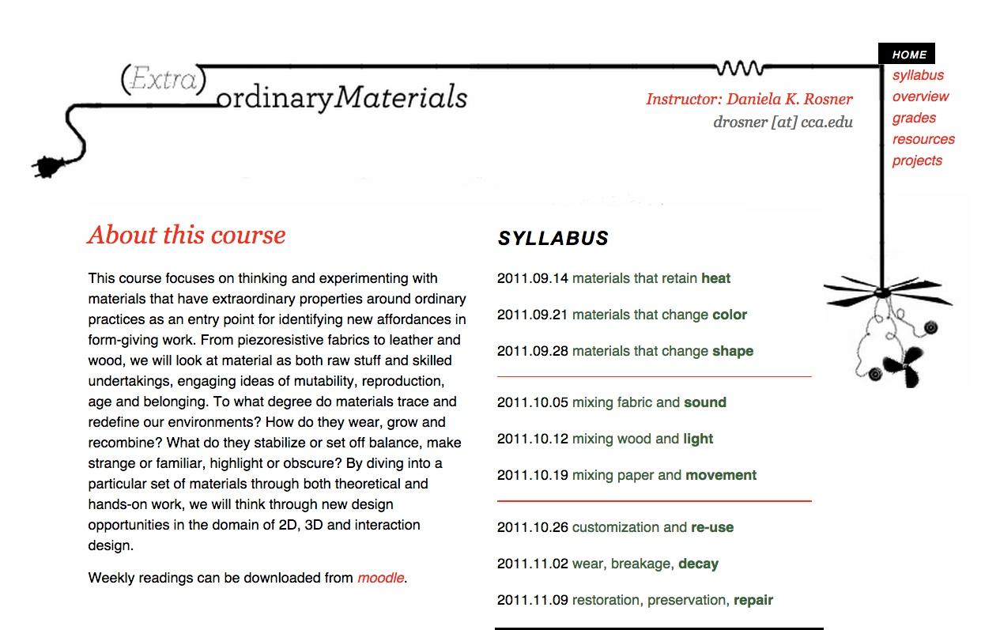
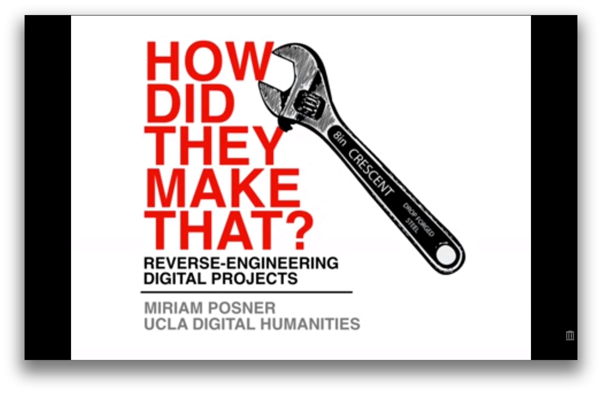

# Praxis

## Authors

* Bethany Nowviskie
* J. K. Purdom Lindblad
* Jeremy Boggs

## List of Curated Pedagogical Resources

* “Bibliocircuitry and the Design of the Alien Everday,” Charity
  Hancock, et. al.,
  http://scholarworks.iu.edu/journals/index.php/textual/article/view/5051
  (sample student projects)
* “Doing Feminist Theory with Digital Video,” Rachel Alpha Johnston
  Hurst, http://adanewmedia.org/2014/07/issue5-hurst/ (article)
* “Extraordinary Materials,” Daniela K. Rosner,
  http://dada.cca.edu/~drosner/materials/syllabus.html (syllabus)
* "How Did They Make That?" Miriam Posner,
  http://miriamposner.com/blog/how-did-they-make-that/ (tech
  showcase/how-to)
* “The Kits for Cultural History at HASTAC 2014,” Nina Belojevic,
  http://maker.uvic.ca/lima/ (sample student projects)
* “Lying about the Past,” T. Mills Kelly,
  http://chnm.gmu.edu/history/faculty/kelly/blogs/h389/f08syl.pdf
  (syllabus)
* **Praxis Network**, http://praxis-network.org (institutional models)
* “Victorian Literature + Victorian Informatics,” Rachel Sagner Buurma,
  http://rachelsagnerbuurma.org/uncategorized/vic_info-draft-syllabus/
  (syllabus)
* “The Wikiblitz: A Wikipedia Editing Assignment in a First Year
  Undergraduate Class (Spring 2012 version),” Shawn Graham,
      http://writinghistory.trincoll.edu/crowdsourcing/graham-2012-spring/
  (class exercise)
* “Writing on Clay,” **A Better Pencil: Readers, Writers, and the
  Digital Revolution,** Dennis E. Baron,
  http://books.google.com/books?id=VWzgtZMJCwgC&lpg=PP1&dq=better%20pencil&pg=PA71#v=onepage&q=modeling%20clay&f=false (class exercise)

## Curatorial Statement

We understand *praxis* as thoughtful performance: a way of making and building less oriented toward the construction of end-products and more concerned
with exposing the processes through which ideas become objects in space or actions in time. In the classroom, a praxis-oriented pedagogy helps students engage with theory through concrete action, and promotes understanding of the complex, playful, and materially-grounded ways in which theoretical or ideological concepts can be realized, exposed, critiqued, and iteratively generated. The pedagogical resources gathered here connect with *praxis* as an opportunity to:

* **embody an idea.** Students make or do something that represents an existing theory or idea. They demonstrate prior understanding through successful performance and instantiation.
* **illuminate an idea.** In the process of making or doing something, students reveal theoretical and intellectual complexities that may have been hidden to them in their initial understanding.
* **critique an idea.** Students challenge or question existing concepts or ideologies by building or performing new alternatives.
* **generate an idea.** New theories or concepts arise, often iteratively and playfully, through performance, construction of objects or systems, and embodied understanding.

### Our Own Pedagogy

We have compiled these resources from the perspective of three digital humanities practitioners engaged in the extra-curricular mentoring and methodological training of graduate students across disciplines at a digital scholarship center: the University of Virginia Scholars' Lab. Almost everything we offer at the Scholars' Lab—from the contributions made by our internal research projects to our workshops and partnerships with faculty and our hosted graduate fellowship programs—features *praxis* as a central concern. We take an uncommon position for a library-based service unit, in that we are more oriented toward building up people, as mentors and partners, than toward building websites or tools as ann on-request service. In our teaching, we are therefore always careful to emphasize *how* and *why* to make or do things, and to promote design thinking and reflective practice. *Praxis* is core to the ethos of the Scholars' Lab and to nearly all of our interactions with collaborators. A pedagogy of *praxis* appreciates built objects and working systems, but attends equally to processes and manners of making, and ensures that both are instructive.

### Rationale and Criteria

We have selected the following resources according to three broad principles.

First, we chose resources that were open-access, available under fair use, or otherwise publicly available.

Second, we wanted to include a range of resources: syllabi that discuss, organize, and present *praxis*-oriented theories and activities to students; sample lessons that themselves embody *praxis* in the sense that they detail processes and outline possible, theoretically-informed outcomes; reflective demonstrations of completed projects or showcases of the tools and processes that have gone into making a particular project, object, or system; and articles that discuss the importance of *praxis* for teaching and learning. It was important to us to include resources that varied in type or format and in domain of application, to show that *praxis* can enter the classroom in a variety of ways.

Finally, we felt it important to select resources that demonstrate the interconnected, symbiotic relationships among *praxis,* theory, and product. All of these resources highlight this importance: that none can or should exist in isolation, and exploring one should necessarily mean exploring the others. We feature resources that, in our view, succeed in demonstrating that the best way to learn the value of *praxis* is by *actively engaging in it*. These resources do not just talk about the importance of *praxis* in the abstract: they provide examples of embodied, theoretically-informed learning in action.

## Curated Pedagogical Resources

### “Bibliocircuitry and the Design of the Alien Everday”

* Screenshot: 
* Source URL: http://scholarworks.iu.edu/journals/index.php/textual/article/view/5051
* Name of Creator: Charity Hancock, Clifford Hichar, Carlea Holl-Jensen, Kari Kraus, Cameron Mozafari, Kathryn Skutlin
* Attribution Information:

An article detailing student exploration of the concept of *reflective
design* by investigating the book as interface. The projects perfectly
highlight the way that an emphasis on, and exposure of, process leads to
unforseen insights. They also emphasize that *digital* often involves
considerations regarding hardware and physical/tactile design. Teachers
might a particular object or set of objects and ask students to figure
out ways to alter or enhance their interface.

### “Doing Feminist Theory through Digital Video”
* Screenshot:
* Source URL:
  [http://adanewmedia.org/2014/07/issue5-hurst/](http://adanewmedia.org/2014/07/issue5-hurst/)
* Name of Creator:
  [http://www.rachelhurst.ca/Dr._Rachel_Alpha_Johnston_Hurst/Welcome%21.html](Rachel
  Alpha Johnston Hurst)
* Attribution Information: Rachel Alpha Johnston Hurst is an associate
  professor of [http://sites.stfx.ca/womens_and_gender_studies/](Women's
  and Gender Studies) at [http://www.stfx.ca/](St. Francis Xavier
  University) in Antigonish, Nova Scotia.

*Doing Feminist Theory through Digital Video* is a reflective essay
detailing Hurst's undergraduate assignment and the literature informing
the development of the assignment. Noticing her undergraduates were
struggling to connect the rich theoretical discussions within the
classroom to 'real life', Hurst details how specific theoretical
considerations (e.g. Feminism) shape and can by shaped by praxis
applications.

Hurst applies Paulo Freire's definition of praxis, 'reflection and
action upon the world in order to change it', to her assignment with the
goal of fostering sustained deep reflection, both of the theoretical
foundations for her course as well as on the student's emerging
scholarly voice.

A semester-long, service-learing project is difficult to integrate into
an existing course. Rather, Hurst's article outlines strategies for
nurturing deep learning through relfection and praxis. Reflecting on her
process as well as implementation, Hurst points to methods for
demystifying knowledge creation through itterative, collaborative
work.

### “Extraordinary Materials”
* Screenshot: 
* Source URL:
  [http://dada.cca.edu/~drosner/materials/syllabus.html](http://dada.cca.edu/~drosner/materials/syllabus.html)
* Name of Creator: [http://danielarosner.com](Daniela K. Rosner)
* Attribution Information: Daniela Rosner is an assistant professor of
  [http://www.hcde.washington.edu/] (Human Centered Design and
  Engineering) and co-direct the
  [http://depts.washington.edu/tatlab/blog/](TAT Lab) at the
  [http://www.washington.edu/](University of Washington)

(Extra)ordinary *Materials* is a course focusing on "thinking and
experimenting with materials that have extraordinary properties around
ordinary practices as an entry point for identifying new affordances in
form-giving work." With a detailed syllabus and a blend of intriguing
readings, hands-on experiements, and student participation,
(Extra)ordinary *Materials* exemplifies praxis through deep
investigations of specific materials along side explorations of the
ideas of  "mutability, reproduction, age and belonging."

Readings are paired with hands-on, both individual and class,
investigations and reflective reports. Rosner includes thoughtful
learning outcomes along with explicit pairings of hands-on work and
theoretical readings to best explore range of materials and
properties.

### “How Did They Make That?”

* Screenshot: 
* Source URL:
  [http://miriamposner.com/blog/how-did-they-make-that/](http://miriamposner.com/blog/how-did-they-make-that/)
* Name of Creator: Miriam Posner
* Attribution Information: Posner coordiates and teaches in the [Digital
  Humanites program at UCLA](http://www.cdh.ucla.edu/). She has a Ph.D.
  from Yale University, in Film Studies and American Studies.

Miriam Posner offers a modest gallery of various digital projects, and
breaks each down into the tools and techniques used in their production.
The goal is to show how each is made, so others might also make similar
projects and build from them. The site would be a perfect starting
point for students before their own digital projects. Have students
visit the site, then visit each example project, to see how the list of
parts and techniques used on a project correspond to specific results.
Get a feel for what different types of projects offer.

### “The Kits for Cultural History at HASTAC 2014”

* Screenshot: 
* Source URL
* Name of Creator
* Attribution Information:

Nina Belojevic provides an introduction and rationale for the *Kits for
Cultural History* projects at the University of Victoria Makerlab. The
kits help humanists explore questions and topics related to cultural
history. They are not intended to be simple instruction manuals, with
step-by-step instructions to complete, but rather encourage inquiry,
modification, and reflection. Examples include: *Electric Jewels*, which
explores 19th-century electric jewelry, and *Tennis for Two*, which
looks at the first video game.  The kits exemplify that praxis is deeper
than simply eschewing prodecure or problem solving.

One obvious way to integrate these into the classroom is to try
recreating the projects themselves. From there, see if students can
create their own, and document the process through which they create
their kits.

### “Lying about the Past”

* Screenshot: 
* Source URL:
  [http://chnm.gmu.edu/history/faculty/kelly/blogs/h389/f08syl.pdf](http://chnm.gmu.edu/history/faculty/kelly/blogs/h389/f08syl.pdf)
* Name of Creator: T. Mills Kelly
* Attribution Information:

In 2001, T. Mills Kelly taught a course entitled "Lying about the Past."
The course covered how to debunk historial hoaxes, and for the final
project students had to create their own and see if they could fool
anyone.

We think the most beneficial way to integrate this into teaching is to
take note of how Kelly presents the class, the topic explored.
Throughout the syllabus, its clear that Kelly considers his students to
be his collaborators, and depends on them to shape the course as much,
if not more, than he himself shapes it.

### The Scholars' Lab Praxis Program and Praxis Network

The Praxis Program reimagines graduate training in the humanities for the demands of the digital age. Each year, we bring together six graduate students from across the humanities and social sciences to design, build, and reflect on a digital tool. Praxis Fellows work alongside the Scholars' Lab staff throughout the cycle of creating, building, and launching a digital project.

The Praxis Network was inspired by the Scholars' Lab Praxis Program, and showcases eight international examples of differing
approaches to collaborative, humanities-based digital methods training. Insitutitions seeking to develop similar
efforts can compare missions, structures, research foci, funding models, and
strategic directions of the Praxis Network
programs.

### “Victorian Literature + Victorian Informatics”
* Screenshot: 
* Source
  URL:[http://rachelsagnerbuurma.org/uncategorized/vic_info-draft-syllabus/]
  (http://rachelsagnerbuurma.org/uncategorized/vic_info-draft-syllabus/)
* Name of Creator: [http://rachelsagnerbuurma.org/](Rachel Sagner
  Buurma)
* Attribution Information: Rachel Sagner Buurma is an associate
  professor in the
  [http://www.swarthmore.edu/english-literature](Department of English
  Literature) at [http://www.swarthmore.edu](Swarthmore College).

Victorian Literature and Victorian Inforamtics is a richly detailed
syllabus exploring "canonical Victorian literature through the lens of
Victorian Informatian theory and knowledge organization practices."
Buurma blends close, middle-distance, and distant reading techniques
with an emphasis on digital tools as a way of reading and
re-reading/re-making literary texts.

With a variety of workshops, demonstrations, discussions, and readings,
Buurma's syllabus exemplifies ways to incorporate new critical methods
and interpretations into familiar material. Individual topics along with
related readings, tools, and workshops can readily be incorporated into
an existing course, or a new course could be developed along a similar
model.

### “The Wikiblitz: A Wikipedia Editing Assignment in a First Year
Undergraduate Class (Spring 2012 version)”
* Screenshot: 
* Source URL:
  [http://writinghistory.trincoll.edu/crowdsourcing/graham-2012-spring/](
  http://writinghistory.trincoll.edu/crowdsourcing/graham-2012-spring/)
* Name of Creator: [http://www.graeworks.net/](Shawn Graham)
* Attribution Information: Shawn Graham is an assistant professor in the
  [http://www.carleton.ca/history/](Department of History) at
  [http://carleton.ca/](Carleton University).

Graham describes an in-class assignment designed to
"explore how knowledge is created and represented on Wikipedia, by
working to improve a single article." Intended to provide deep
understandings of how knowledge is created by and used via digital
platforms, Graham's assignment was situated in a course exploring
historical materials on the Internet. Graham's article reflects on the
overall course and the specifics of the Wikipedia assignment with a
particular focus on preparing students to engage with and critique the
tools for wriitng history in our digital age.

Graham's article is particularly useful as he outlines the context in
which the assignment was situated into the broader course, the expected
and unexpected outcomes, his rubric, and student feedback. Graham
details the work invested in preparing students for the 2-course
sessions assignment, which smooth the process of adapting the assignment
for other courses.

### “Writing on Clay”

* Screenshot: 
* Source URL:
  [http://books.google.com/books?id=VWzgtZMJCwgC&lpg=PP1&dq=better%20pencil&pg=PA74#v=onepage&q=modeling%20clay&f=false](Lesson
  Plan, Writing on Clay)
* Name of Creator:
  [http://www.english.illinois.edu/-people-/faculty/debaron/](Dennis E.
  Baron)
* Attribution Information: Dennis Baron is a professor of
  [http://www.english.illinois.edu/](English) at the
  [http://illinois.edu/](University of Illinois).

Baron's deceptively simple in-class exercise on writing with clay
encourages students to think about how technology affects their writing,
reading, and understanding. Foregrounding the materiality of expression,
Baron's exercise makes obvious the many layers of the physical act of
communication. To write on clay, the student must prepare the surface,
estimate the expected space needed for the writing, adjust methods for
correcting mistakes or revising the text, as well as calls into question
ways of sharing and preserving the finished writing.

Baron's exercise requires little pre-planning, but does demand time for
reflection.

## 5. Related Materials (Bulleted List)

* **Pedagogy of the Oppressed**,
  http://fablearn.stanford.edu/fellows/blog/pedagogy-oppressed-practice-praxis
* **New Culture of Learning**, http://www.newcultureoflearning.com/
* “Connected Learning: An Agenda for Research and Design,”
  http://clrn.dmlhub.net/publications/connected-learning-an-agenda-for-research-and-design
* Rob Pope, *Textual Intervention: Critical and Creative Strategies for
  Literary Studies.* Psychology Press, 1995. — and this 1995 review:
  David E. Stacey, Book Review: *Textual Intervention: Critical and
  Creative Strategies for Literacy* by Rob Pope.” JAC Online 17.1:
  [http://www.jaconlinejournal.com/archives/vol17.1.html] Direct link:
  [http://www.jaconlinejournal.com/archives/vol17.1/stacy-textual.pdf]
* Johanna Drucker, “Theory as Praxis: The Poetics of Electronic
  Textuality,”
  https://muse.jhu.edu/journals/modernism-modernity/v009/9.4drucker.html

## 6. Works Cited

“Bibliocircuitry and the Design of the Alien Everday,” Charity Hancock,
et. al.,
http://scholarworks.iu.edu/journals/index.php/textual/article/view/5051
(sample student projects)

“Doing Feminist Theory with Digital Video,” Rachel Alpha Johnston Hurst,
http://adanewmedia.org/2014/07/issue5-hurst/ (article)

“Extraordinary Materials,” Daniela K. Rosner,
http://dada.cca.edu/~drosner/materials/syllabus.html (syllabus)

"How Did They Make That?" Miriam Posner,
http://miriamposner.com/blog/how-did-they-make-that/ (tech
showcase/how-to)

“The Kits for Cultural History at HASTAC 2014,” Nina Belojevic,
http://maker.uvic.ca/lima/ (sample student projects)

“Lying about the Past,” T. Mills Kelly,
http://chnm.gmu.edu/history/faculty/kelly/blogs/h389/f08syl.pdf
(syllabus)

**Praxis Network**, http://praxis-network.org (institutional models)

“Victorian Literature + Victorian Informatics,” Rachel Sagner Buurma,
http://rachelsagnerbuurma.org/uncategorized/vic_info-draft-syllabus/
(syllabus)

“The Wikiblitz: A Wikipedia Editing Assignment in a First Year
Undergraduate Class (Spring 2012 version),” Shawn Graham,
http://writinghistory.trincoll.edu/crowdsourcing/graham-2012-spring/
(class exercise)

“Writing on Clay,” **A Better Pencil: Readers, Writers, and the Digital
Revolution,** Dennis E. Baron,
http://books.google.com/books?id=VWzgtZMJCwgC&lpg=PP1&dq=better%20pencil&pg=PA71#v=onepage&q=modeling%20clay&f=false

**Pedagogy of the Oppressed**,
http://fablearn.stanford.edu/fellows/blog/pedagogy-oppressed-practice-praxis

**New Culture of Learning**, http://www.newcultureoflearning.com/

“Connected Learning: An Agenda for Research and Design,”
http://clrn.dmlhub.net/publications/connected-learning-an-agenda-for-research-and-design

Rob Pope, *Textual Intervention: Critical and Creative Strategies for
Literary Studies.* Psychology Press, 1995. — and this 1995 review:

David E. Stacey, Book Review: *Textual Intervention: Critical and
Creative Strategies for Literacy* by Rob Pope.” JAC Online 17.1:
[http://www.jaconlinejournal.com/archives/vol17.1.html] Direct link:
[http://www.jaconlinejournal.com/archives/vol17.1/stacy-textual.pdf]

Johanna Drucker, “Theory as Praxis: The Poetics of Electronic
Textuality,”
https://muse.jhu.edu/journals/modernism-modernity/v009/9.4drucker.html

**Scholars' Lab Charter**, http://scholarslab.org/about/charter/
